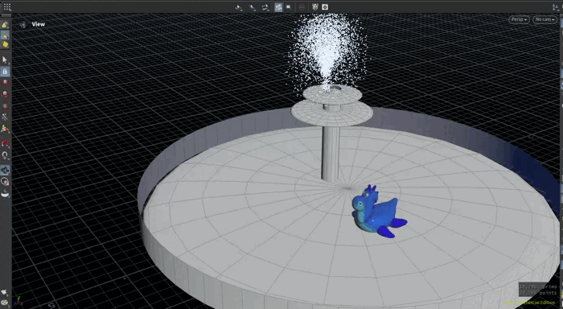

# Hola, soy Marta Pérez Roldán

Estudiante de Ingeniería de Software y Física Computacional con Título Propio en Inteligencia Artificial. 

## Ahora mismo
Estoy construyendo mi portfolio en GitHub con proyectos pequeños pero bien terminados.

## Proyectos 
<!--- [Nombre proyecto 1](enlace)
- [Nombre proyecto 2](enlace) -->

### Motor Gráfico 3D con Iluminación y Colisiones 
Es un motor gráfico programado desde cero en C++ con OpenGL. 

**Permite**: 
- Objetos a los que se les puede aplicar textura, moverlos y rotarlos.
- Movimiento de cámara.
- Detección de colisiones.
- Iluminación con el modelo de Phong y sombras.

### Problema de los tres cuerpos
Simulación en Python del problema de los tres cuerpos con integración numérica por el método de Euler.

### Simulación de fuego y humo con una Vela
Una vela encendida con una tapa móvil que desplaza el flujo de humo.

### Simulación de partículas

Un sistema de partículas que simula una fuente.
